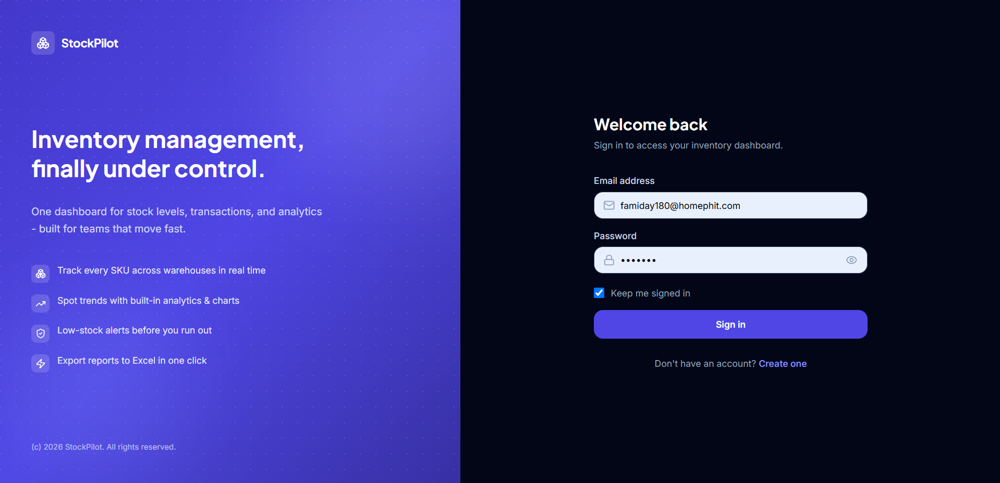
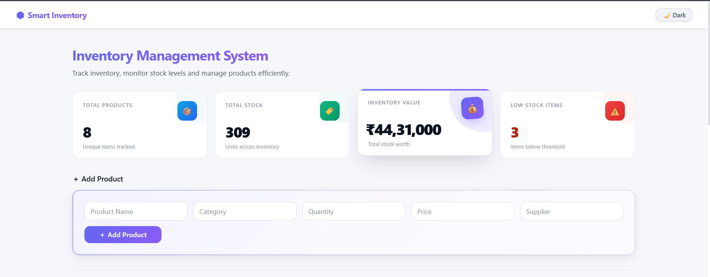
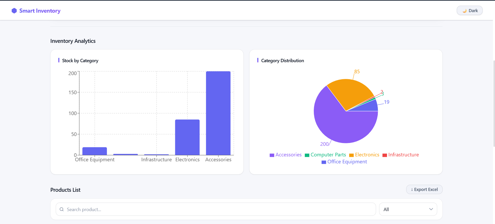
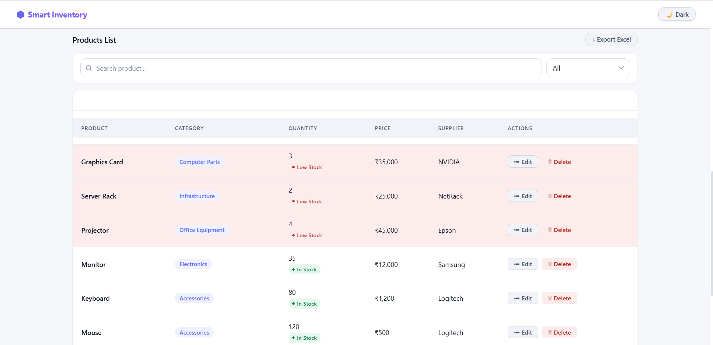
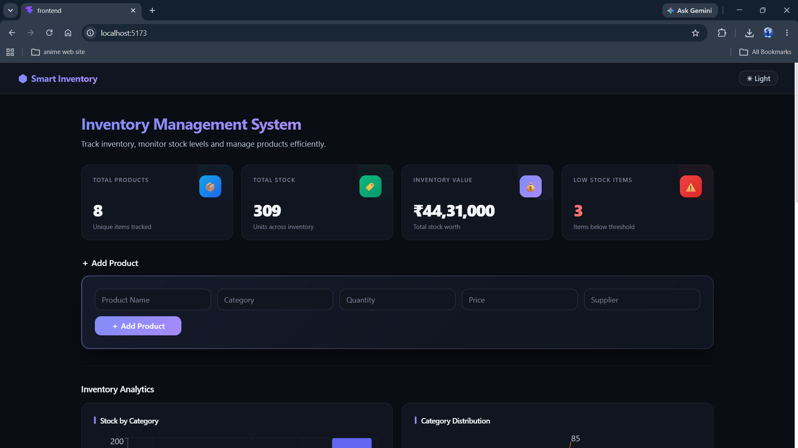

# Smart Inventory Management System

A full-stack MERN inventory dashboard for authenticated users to manage products,
track stock movement, review analytics, and export inventory data to Excel.

## Features

- JWT login and registration
- User-specific inventory records
- Add, edit, delete, search, and filter products
- Server-side pagination with 10 products per page
- Low-stock notification badge
- Dashboard summary cards
- Category analytics and 30-day stock movement chart
- Sales / purchase transaction log
- XLSX export
- Dark / light theme toggle
- Mobile-first responsive UI

## Tech Stack

| Layer | Technology |
| --- | --- |
| Frontend | React, Vite, Tailwind CSS |
| Charts | Recharts |
| Export | XLSX |
| Backend | Node.js, Express.js |
| Auth | JWT, bcryptjs |
| Database | MongoDB, Mongoose |
| Deployment | Render backend, Vercel frontend |

## Screenshots

Place updated screenshots in the `screenshots/` folder.







## Local Setup

### Backend

```bash
cd backend
npm install
copy .env.example .env
npm run dev
```

Set `MONGO_URI` and `JWT_SECRET` in `backend/.env`.

### Frontend

```bash
cd frontend
npm install
copy .env.example .env
npm run dev
```

The frontend expects `VITE_API_URL=http://localhost:5000/api` locally.

## Deployment

### Render Backend

1. Create a new Render Blueprint from this repository, or create a Web Service
   using `backend` as the root directory.
2. Use `npm install` as the build command and `npm start` as the start command.
3. Add environment variables:
   - `MONGO_URI`
   - `JWT_SECRET`
   - `JWT_EXPIRES_IN=7d`
   - `CLIENT_URL=https://your-vercel-app.vercel.app`

The repository includes `render.yaml` for Blueprint deployment.

### Vercel Frontend

1. Import the repository in Vercel.
2. Set the project root to `frontend`.
3. Add `VITE_API_URL=https://your-render-service.onrender.com/api`.
4. Deploy.

The frontend includes `frontend/vercel.json`.

## API Endpoints

All product and transaction routes require:

```http
Authorization: Bearer <jwt-token>
```

| Method | Route | Description |
| --- | --- | --- |
| POST | `/api/auth/register` | Register a user and return a JWT |
| POST | `/api/auth/login` | Login and return a JWT |
| GET | `/api/auth/me` | Return the current user |
| GET | `/api/products?page=1&limit=10&search=&category=All&status=All` | Paginated products with summary and categories |
| POST | `/api/products/add` | Create a product |
| GET | `/api/products/export` | Return all products for XLSX export |
| GET | `/api/products/analytics` | Return category totals and 30-day stock movement |
| GET | `/api/products/:id` | Return one product |
| PUT | `/api/products/:id` | Update one product |
| DELETE | `/api/products/:id` | Delete one product and its transactions |
| POST | `/api/transactions` | Record stock-in or stock-out and update product quantity |
| GET | `/api/transactions` | Return the latest 50 transactions |

## Project Structure

```text
smart-inventory-system
|-- backend
|   |-- middleware
|   |-- models
|   |-- routes
|   |-- server.js
|   `-- package.json
|-- frontend
|   |-- src
|   |   |-- components
|   |   |-- api.js
|   |   |-- App.jsx
|   |   |-- App.css
|   |   `-- main.jsx
|   |-- vercel.json
|   `-- package.json
|-- screenshots
|-- render.yaml
`-- README.md
```

## Author

Mohammed Nawaz

## License

This project is created for educational and portfolio purposes.
