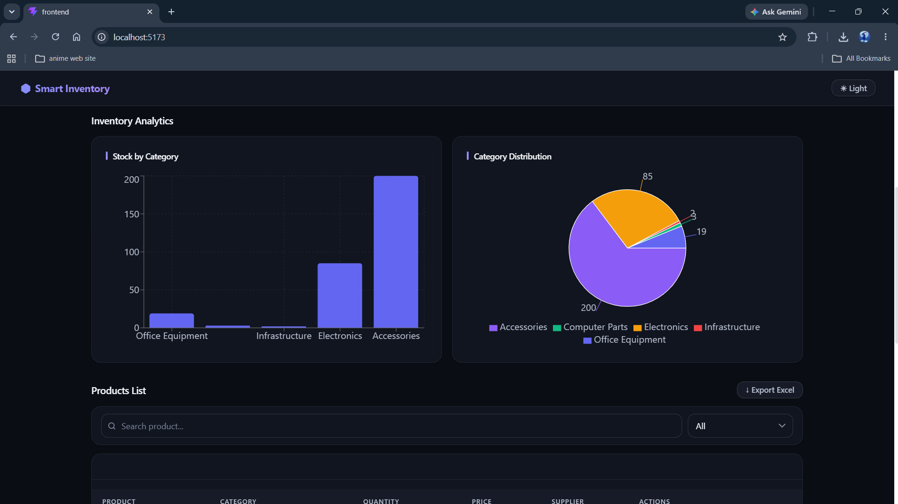
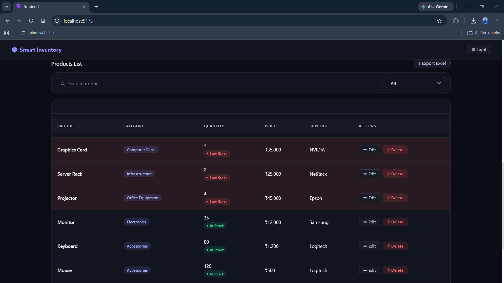
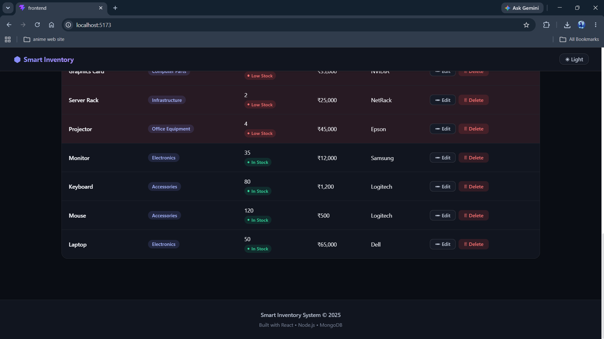

# StockPilot

> A full-stack inventory management dashboard for keeping products, stock
> movement, and low-stock alerts in one clear workspace.

[Live application](https://stockpilot-im-app.vercel.app) · [API](https://stockpilot-api-app.vercel.app)


## Highlights

- Create an account and access a private, JWT-protected inventory workspace.
- Add, edit, delete, search, filter, paginate, and export products to Excel.
- Set a reorder point for each product and spot low- or zero-stock items early.
- Record stock-in and stock-out activity with validation that prevents negative
  inventory.
- Review inventory value, product totals, category distribution, and 30-day
  stock movement trends.
- Work comfortably in responsive light and dark themes with toast feedback,
  confirmations, and a stock-alert notification panel.

## Tech stack

| Area | Tools |
| --- | --- |
| Frontend | React, Vite, Tailwind CSS, React Router, Axios |
| Backend | Node.js, Express, MongoDB, Mongoose |
| Authentication | JSON Web Tokens, bcryptjs |
| Data & charts | Recharts, SheetJS / xlsx |
| Security | Helmet, CORS, express-rate-limit |
| Hosting | Vercel frontend and serverless API |

## Screenshots

| Sign in | Dashboard |
| --- | --- |
|  |  |

| Product management | Analytics |
| --- | --- |
|  |  |

| Dark theme — dashboard | Dark theme — products |
| --- | --- |
|  |  |

| Dark theme — transactions | Dark theme — analytics |
| --- | --- |
|  |  |

## Run locally

### Prerequisites

- Node.js 20 or later
- npm
- A MongoDB connection string

### 1. Install dependencies

```bash
npm install --prefix backend
npm install --prefix frontend
```

### 2. Configure environment variables

Create `backend/.env` from [`backend/.env.example`](backend/.env.example):

```env
PORT=5000
MONGO_URI=your-mongodb-connection-string
JWT_SECRET=use-a-long-random-secret
JWT_EXPIRES_IN=7d
CLIENT_URL=http://localhost:5173
```

Create `frontend/.env` from [`frontend/.env.example`](frontend/.env.example):

```env
VITE_API_URL=http://localhost:5000/api
```

### 3. Start the application

Run each command in a separate terminal:

```bash
npm run dev --prefix backend
```

```bash
npm run dev --prefix frontend
```

Open `http://localhost:5173`.

## Deploy on Vercel

1. Create a Vercel project with `backend` as its root directory. Add
   `MONGO_URI`, `JWT_SECRET`, `JWT_EXPIRES_IN`, and `CLIENT_URL` to its
   environment variables.
2. Create a second Vercel project with `frontend` as its root directory. Set
   `VITE_API_URL` to `https://your-api-domain/api`.
3. Set the backend's `CLIENT_URL` to the deployed frontend URL, then redeploy
   the API if the variable changed.

The repository includes `backend/vercel.json` for the serverless Express API
and `frontend/vercel.json` for Vite single-page-app routing.

## Verify the project

```bash
npm run lint --prefix frontend
npm run build --prefix frontend
node --check backend/server.js
node --check backend/app.js
node --check backend/api/index.js
```

The API root is available at `/`; product and transaction routes require a
valid bearer token.

## License

Created for educational and portfolio use.
